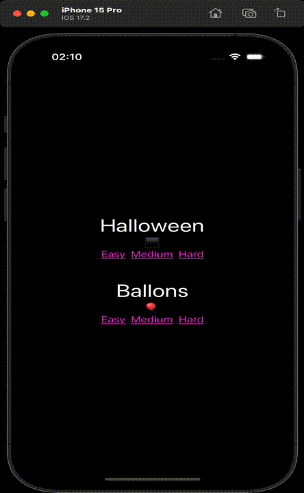

# MemoryGame

A MemoryCardGame for iOS made with **SwiftUI**.

Make pairs by tapping on two identical cards. Win where there are no pairs left to be made.

## Features:

* MVVM architecture
   * [CardGame](https://github.com/cmp-byte/MemoryGame/blob/main/MemoryGame/Models/CardGame.swift) - [CardViewModel](https://github.com/cmp-byte/MemoryGame/blob/main/MemoryGame/Game/GameViewModel.swift) - [GameScreen](https://github.com/cmp-byte/MemoryGame/blob/main/MemoryGame/Game/GameScreen.swift)
   
* [StackNavigation](https://github.com/cmp-byte/MemoryGame/blob/c34fe709044b0f4f2c35fb6c22949fdba9c73b91/MemoryGame/Menu/MenuScreen.swift#L42) using [NavigationView](https://github.com/cmp-byte/MemoryGame/blob/c34fe709044b0f4f2c35fb6c22949fdba9c73b91/MemoryGame/Menu/MenuScreen.swift#L26)

* [Time limit](https://github.com/cmp-byte/MemoryGame/blob/c34fe709044b0f4f2c35fb6c22949fdba9c73b91/MemoryGame/Game/GameScreen.swift#L58) for finishing a game.

* [Limited](https://github.com/cmp-byte/MemoryGame/blob/c34fe709044b0f4f2c35fb6c22949fdba9c73b91/MemoryGame/Game/GameScreen.swift#L54) number of possible failed matches

* Animation for [shuffling cards](https://github.com/cmp-byte/MemoryGame/blob/c34fe709044b0f4f2c35fb6c22949fdba9c73b91/MemoryGame/Game/GameScreen.swift#L48) and a custom animation for [flipping cards](https://github.com/cmp-byte/MemoryGame/blob/c34fe709044b0f4f2c35fb6c22949fdba9c73b91/MemoryGame/Ui/CardUi.swift#L50)

* [Custom colors](https://github.com/cmp-byte/MemoryGame/blob/main/MemoryGame/Ui/ColorScheme.swift) for dark and light mode 

* [Landscape mode](https://github.com/cmp-byte/MemoryGame/blob/c34fe709044b0f4f2c35fb6c22949fdba9c73b91/MemoryGame/Menu/MenuScreen.swift#L28) compatibility

* [iPad](https://github.com/cmp-byte/MemoryGame/blob/c34fe709044b0f4f2c35fb6c22949fdba9c73b91/MemoryGame/Game/GameScreen.swift#L11) adjustments

* Integrated a [static library](https://github.com/cmp-byte/GameSource) for getting [remote values](https://github.com/cmp-byte/MemoryGame/blob/c34fe709044b0f4f2c35fb6c22949fdba9c73b91/MemoryGame/Menu/MenuViewModel.swift#L22)

* Three levels of difficulty wich affects various [game parameters](https://github.com/cmp-byte/MemoryGame/blob/c34fe709044b0f4f2c35fb6c22949fdba9c73b91/MemoryGame/Models/CardGame.swift#L97) and [mechanics](https://github.com/cmp-byte/MemoryGame/blob/c34fe709044b0f4f2c35fb6c22949fdba9c73b91/MemoryGame/Models/CardGame.swift#L83).

* [Scoring algorithm](https://github.com/cmp-byte/MemoryGame/blob/c34fe709044b0f4f2c35fb6c22949fdba9c73b91/MemoryGame/Models/CardGame.swift#L142) depending on HotStreaks, Difficulty chosen and number of matched cards.

* Locally stored [leaderboard](https://github.com/cmp-byte/MemoryGame/blob/main/MemoryGame/Ui/LeaderBoard.swift) for winning players.

* Unit test on models using [XCTest](https://github.com/cmp-byte/MemoryGame/blob/main/MemoryGameTests/MemoryGameTests.swift)

## References

* [Standford 193p iOS](https://www.youtube.com/watch?v=bqu6BquVi2M&list=PLpGHT1n4-mAsxuRxVPv7kj4-dQYoC3VVu)

* [iOS Academy](https://www.youtube.com/watch?v=fHtF7BQLlAU&list=PL5PR3UyfTWvfgx9W8WJ9orQf6N1tx0oxN) 

* [How to make static libraries](https://stackoverflow.com/a/55899567)

* Documentation when needed + other web articles

## Left for improvement

* Better iPad compatibility

* Improved navigation

* Improved UI/UX 

## Demo iPhone

## Demo iPad

